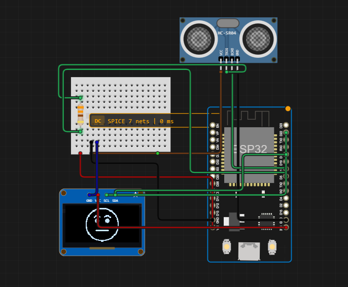

# DeskPet
Come with me as I figure out how to make a desk pet. An electronic robot.

#Story:
When I was in high school, I confessed to my friends that when I was younger, I used to have a crush on Optimus Prime from transformers. 
They bullied me for that.
Unfortunaly, a few days later, I read a sad story relating to robots, and overcome by sympathy, I drew one of them and felt proud of myself. So I showed my friends that, and they soon began to call the robot a love child of me and optimus Prime. I played into it, naming my son Richard (Pronounced "Gerald-D")

Now, I am planning to make my son from a drawing, into a reality, so my friends may clown on me more.

# Day 1
I start by planning what I need, picking out what components I think would be useful to what I will do.  

## Hardware:
1. ESP32 DevKit V1: combines powerful dual core processing, wireless, and can connect to my breadboard. Most importantly, it's cheap.
2. HC-SR04 Sensor: Ultrasonic distance sensor. Useful for the robot to know when it will crash into the wall so turns before it crashes.
3. SSD1306 OLED: Cheap OLED.
4. TB6612FNG Driver Module: Gives two independent motor channels. Useful since mine is a two wheel robot. Cheap too.
5. DC motors: Need something to turn the wheels... cheap.

After planning out my artichure, I got on Velxio, a free open source website where I can figure out how the components work together without buring anything, harming my soon to be child or burning down my house. I begin by planning what I want to use as hardware.

I then added a HC-SR04 sensor and psudo cooded my plans on how to implement the motors in the future. If there is something in front of Richard (Pronounced "Gerald-D"), then he will turn either right or left. 

Finally, I added an animation for his face, which is a place holder for now until I begin the project, where I will make my own with his actual face. 

# Day 2

In day two, the Driver Module I was planning to use is not simulated in Velxio, so I substitued it with the closest thing it had, an L293D driver module. I learned how to connect it and code for it, and to replace the lack of motors and wheels, I used mortorized fans instead.

I began working on the motions.h file, where I coded the drive forward, reverse, turn left, turn right, and stop. For some reason, even the wires in the simulation got loose, so I had to rewire it too many times. Finally, I managed to get all my functions simulated correctly, but there does need to be some fixes.

## Fixes:
1. The sensor being made to wait for 3000 nanoseconds is inefficent.
2. the motors turn right and turn left need to fully stop before it loops again, so I need to add the STop(); function before it once more turns.
3. Once the sensor exceedes 20cm, the numbers get inaccurate. It is not an issue since I want it to only detect up to 20cm before turning.
4. Add more mood states, but only for the real Richard (Pronounced "Gerald-D")
5. Add speed. How fast or slow he can go.

img src = "PicturesForRobot/Day2Sim.png" width = "500">

I also drew a rough sketch of him as I have lost the original drawing. (Note: please do not hate him too. I am no longer that good at drawing as my hs self)
img src = "PicturesForRobot/Richard.png" width = "500">
